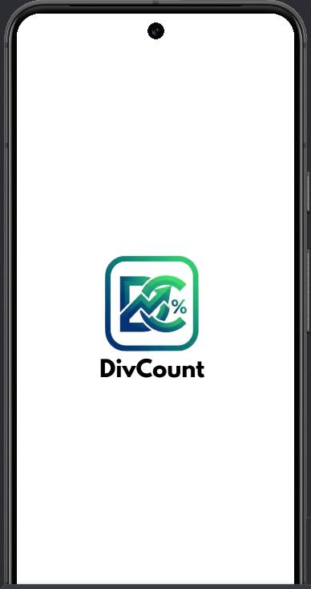
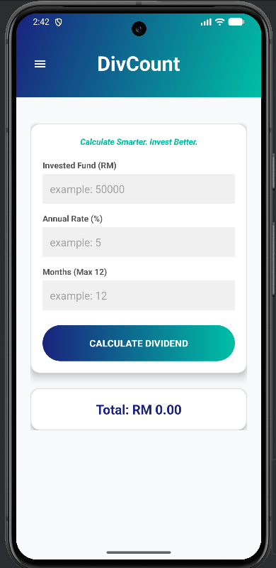
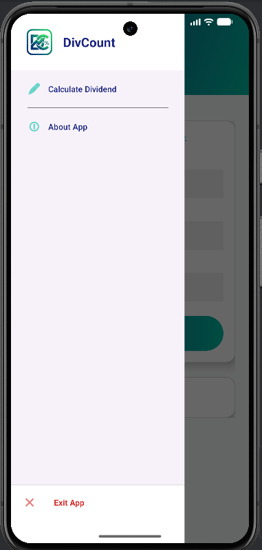
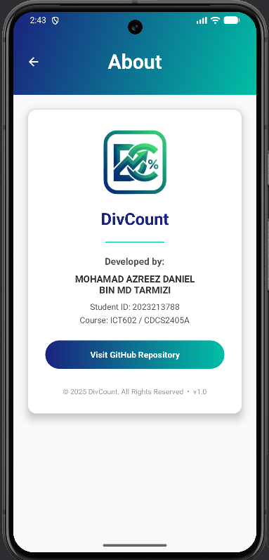

# 📈 DivCount - Dividend Calculator App

**DivCount** is a modern, stylish Android application designed to help investors and students quickly calculate potential dividend returns. With a focus on user experience, the app features a sleek "Edge-to-Edge" gradient interface, intuitive navigation, and precise financial calculations.

---

## 📱 About the App
DivCount solves the problem of manual financial estimations by providing a quick and accurate tool for calculating Return on Investment (ROI) from dividends. Whether you are tracking stock dividends or ASB financing returns, DivCount simplifies the math into three easy inputs:
1. **Invested Amount** (RM)
2. **Annual Dividend Rate** (%)
3. **Duration** (Months)

The app instantly computes the total dividend earned, helping users make smarter investment decisions.

---

## ✨ Features
* **💸 Instant Calculation:** Real-time computation of dividend earnings based on custom inputs.
* **🎨 Modern UI/UX:** Features a custom gradient theme (Deep Blue to Teal) with rounded card interfaces and shadow elevations.
* **📱 Edge-to-Edge Design:** Fully immersive layout that draws behind the status bar for a premium look.
* **≡ Side Navigation Drawer:** A professional sliding menu to navigate between the Calculator and About pages.
* **🚀 Splash Screen:** A branded launch screen with a custom logo and seamless transition.
* **⚡ Smart Input Handling:** Includes error validation to ensure correct data entry (e.g., maximum 12 months).

---

## 📸 Screenshots
*(Upload your screenshots to the `screenshots` folder in your project)*

| Splash Screen | Calculator Home | Side Menu | About Page |
|:---:|:---:|:---:|:---:|
|  |  |  |  |

---

## 🎥 Video Presentation
Check out the full demonstration of the app in action:

[**▶️ Click Here to Watch the Demo Video**](PUT_YOUR_YOUTUBE_LINK_HERE)

---

## 🛠 Installation
You can install the app directly on your Android phone without using a computer.

1.  **Download the APK**
    * Go to the **[Releases](../../releases)** section of this repository.
    * Download the latest `DivCount.apk` file to your phone.

2.  **Allow Unknown Sources**
    * If your phone blocks the installation, go to **Settings > Security**.
    * Enable **"Install from Unknown Sources"** for your browser or file manager.

3.  **Install & Run**
    * Open the downloaded file and tap **Install**.
    * Once finished, you will find **DivCount** in your app drawer!

---

## ⚙️ Requirements
* **Operating System:** Android 8.0 (Oreo) or higher.
* **Storage:** Approximately 10MB of free space.
* **Permissions:** None required (Calculations are performed locally).

---

## © Copyright & Credits
**Developed by:**

MOHAMAD AZREEZ DANIEL BIN MD TARMIZI

© 2025 DivCount. All Rights Reserved.